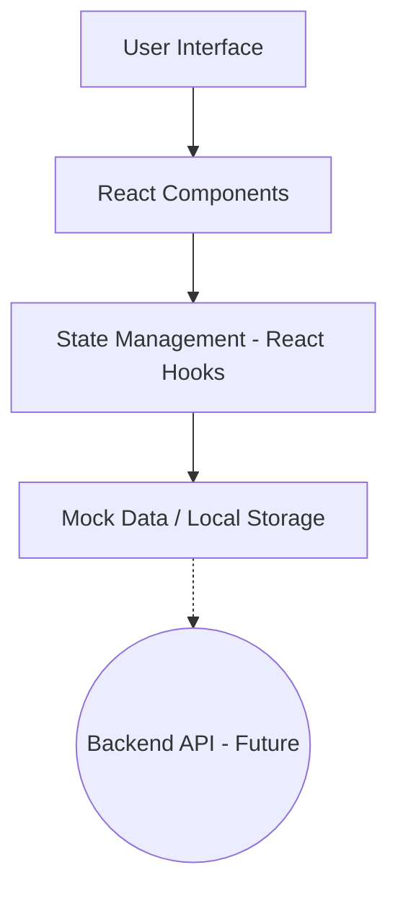

# Kiến trúc hệ thống (Architecture)

Tài liệu này mô tả tổng quan về cấu trúc kỹ thuật, luồng dữ liệu và hệ thống thiết kế của dự án VietElite Weekly Teaching Schedule.

## 1. Tech Stack

Dự án được xây dựng dựa trên các công nghệ hiện đại, tối ưu cho hiệu năng và trải nghiệm lập trình.

- **Frontend Framework**: [React 19](https://react.dev/)
- **Build Tool**: [Vite 8](https://vitejs.dev/)
- **Ngôn ngữ**: [TypeScript 6](https://www.typescriptlang.org/)
- **Styling**: [Tailwind CSS 4](https://tailwindcss.com/)
- **Icons**: [Material Symbols Outlined](https://fonts.google.com/icons)
- **Fonts**: 
  - `Manrope`: Sử dụng cho tiêu đề (Headlines).
  - `Inter`: Sử dụng cho nội dung chính (Body/Labels).

## 2. Design System (Hệ thống thiết kế)

Hệ thống sử dụng bảng màu xanh lá đặc trưng của VietElite, mang lại cảm giác chuyên nghiệp và tin cậy.

| Thành phần | Mã màu (HEX) | Vai trò |
| :--- | :--- | :--- |
| **Primary** | `#2c6c00` | Màu thương hiệu chính, nút quan trọng |
| **Primary Container** | `#6cb145` | Màu nền cho các thẻ, hover state |
| **Background / Surface** | `#f7fbee` | Màu nền tổng thể của ứng dụng |
| **Secondary** | `#4b663a` | Màu hỗ trợ cho các thành phần phụ |
| **Error** | `#ba1a1a` | Thông báo lỗi hoặc trạng thái cảnh báo |

## 3. Luồng dữ liệu (Data Flow)

Hiện tại, ứng dụng đang hoạt động ở chế độ **Client-side only** với dữ liệu mẫu (Mock Data).

> [!NOTE]
> Hệ thống Backend API đang trong quá trình phát triển và sẽ được tích hợp sớm qua các dịch vụ RESTful.

## 4. Cấu trúc thư mục `src/`

- `components/`: Chứa các UI components dùng chung (Button, Card, Layout...).
- `pages/`: Các trang chính của ứng dụng (Dashboard, Schedule...).
- `hooks/`: Các custom hooks xử lý logic logic.
- `utils/`: Các hàm tiện ích, format dữ liệu.
- `styles/`: Các file CSS cấu hình thêm ngoài Tailwind.
- `assets/`: Hình ảnh, icons tĩnh.
