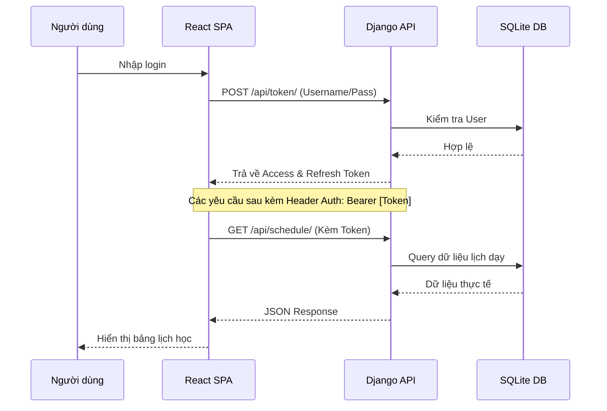

# Tài liệu Kiến trúc Hệ thống (System Architecture)

Dự án: **VietElite Weekly Teaching Schedule**  
Phiên bản: **2.0.0 (Fullstack Integration)**  
Người thực hiện: **Senior Solution Architect**

---

## 1. Công nghệ sử dụng (Tech Stack)

Hệ thống được xây dựng trên mô hình Client-Server hiện đại, tập trung vào hiệu năng, bảo mật và khả năng mở rộng.

### Frontend
- **Framework**: [React 19](https://react.dev/) (Functional Components, Hooks)
- **Build Tool**: [Vite 8](https://vitejs.dev/)
- **Ngôn ngữ**: [TypeScript 6](https://www.typescriptlang.org/)
- **Styling**: [Tailwind CSS 4](https://tailwindcss.com/)
- **Routing**: [React Router 7](https://reactrouter.com/)
- **Icons**: [Lucide React](https://lucide.dev/) & Material Symbols

### Backend
- **Framework**: [Django 5.2](https://www.djangoproject.com/)
- **API Framework**: [Django REST Framework (DRF) 3.16](https://www.django-rest-framework.org/)
- **Authentication**: [SimpleJWT 5.5](https://django-rest-framework-simplejwt.readthedocs.io/)
- **Database**: [SQLite](https://sqlite.org/) (Môi trường Development)
- **Documentation**: [DRF Spectacular](https://drf-spectacular.readthedocs.io/) (OpenAPI 3.0)

---

## 2. Cấu trúc thư mục (Project Structure)

Dự án được tổ chức theo cấu trúc Monorepo đơn giản với hai thành phần chính: `backend` và `client`.

```text
project_teachingschedule/
├── backend/                # Nguồn mã nguồn hệ thống Server
│   ├── apps/               # Các ứng dụng nội bộ (Internal Apps)
│   │   ├── app/            # Logic nghiệp vụ chính (Lớp, Ca dạy, Lịch dạy)
│   │   └── users/          # Quản lý người dùng và Authentication
│   ├── core/               # Cấu hình hệ thống (Settings, URL chính)
│   ├── manage.py           # Công cụ điều hành Django
│   └── requirements.txt    # Danh sách thư viện Python
├── client/                 # Nguồn mã nguồn ứng dụng Web (Frontend)
│   ├── src/                # Mã nguồn React
│   │   ├── components/     # UI Components dùng chung (Button, Modal...)
│   │   ├── services/       # Tầng gọi API và xử lý Data Logic
│   │   ├── pages/          # Các trang giao diện chính
│   │   ├── contexts/       # Quản lý trạng thái toàn cục (Auth, UI)
│   │   ├── utils/          # Hàm tiện ích (Format thời gian, Helper)
│   │   └── config/         # Cấu hình môi trường và API endpoints
│   ├── docs/               # Tài liệu dự án (bao gồm file này)
│   └── package.json        # Cấu hình dependencies Node.js
└── README.md               # Hướng dẫn cài đặt nhanh
```

### Quy chuẩn đặt tên (Naming Convention)
- **Frontend Components**: `PascalCase` (VD: `AddSessionModal.tsx`)
- **Frontend Services/Hooks/Utils**: `camelCase` (VD: `auth.service.ts`, `useSchedule.ts`)
- **Backend Files/Variables**: `snake_case` (Quy chuẩn Python/Django)
- **Backend Models**: `PascalCase` (VD: `LichDay`, `CaDay`)

---

## 3. Phân tầng trách nhiệm (Layered Responsibility)

Dự án áp dụng kiến trúc phân lớp để tách biệt logic, thuận tiện cho việc bảo trì và kiểm thử.

### UI Layers (Presentation Layer)
- **Vị trí**: `client/src/pages` và `client/src/components`.
- **Vai trò**: Chỉ xử lý hiển thị dữ liệu và nhận đầu vào từ người dùng. Không chứa logic nghiệp vụ nặng.

### Service Layer (Business Logic)
- **Vị trí**: `client/src/services` (Frontend) và `backend/apps/*/views.py` (Backend).
- **Vai trò**: Nơi xử lý logic nghiệp vụ chính như tính toán thời gian, kiểm tra điều kiện tạo ca dạy, và điều phối các lệnh gọi API/truy vấn.

### Data Access Layer (Repository/Infrastructure)
- **Vị trí**: `backend/apps/*/models.py` và `serializers.py`.
- **Vai trò**: Chỉ làm việc trực tiếp với Queryset của Database hoặc định dạng dữ liệu trả về cho Client.

### Domain Models/Entities
- **Vị trí**: `backend/apps/*/models.py`.
- **Vai trò**: Định nghĩa cấu trúc dữ liệu cốt lõi và các mối quan hệ (Relational) giữa các thực thể như Giáo viên, Lớp học, Ca dạy.

---

## 4. Luồng dữ liệu và Bảo mật (Data Flow & Security)

Hệ thống sử dụng cơ chế xác thực Stateless thông qua JWT (JSON Web Token).



---

## 5. Quy chuẩn tạo file và vị trí (File Placement Rules)

Để giữ cho dự án luôn ngăn nắp, mọi file mới phải tuân thủ quy tắc vị trí sau:

| Loại File | Thư mục Frontend (`src/`) | Thư mục Backend (`apps/`) |
| :--- | :--- | :--- |
| **Giao diện (UI)** | `components/` hoặc `pages/` | N/A |
| **Logic nghiệp vụ** | `services/` | `views.py` hoặc `services.py` |
| **Truy vấn DB** | N/A | `models.py` hoặc `serializers.py` |
| **Tiện ích (Helper)** | `utils/` | `utils.py` (trong từng app) |
| **Cấu hình (Config)** | `config/` | `core/settings.py` |

> [!CAUTION]
> **KHÔNG ĐƯỢC** thực hiện logic gọi API trực tiếp trong file Component. Mọi lệnh gọi API phải thông qua lớp `services/`.
